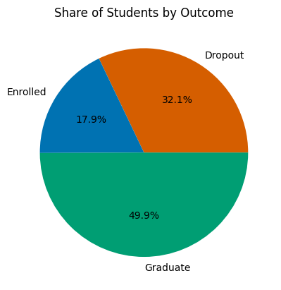
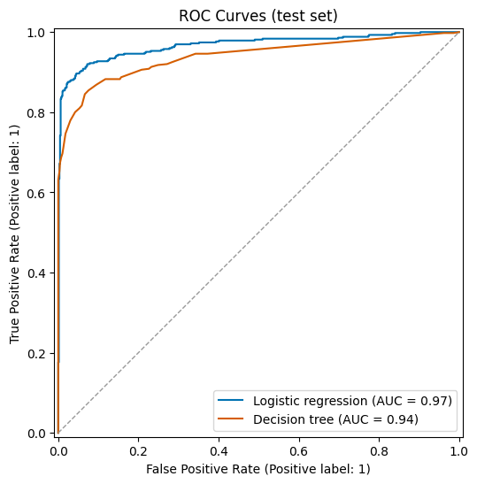

## Predicting Undergraduate Academic Success

[](https://github.com/n8mauer/LogarithmicAcademicSuccess/actions/workflows/ci.yml)

### Executive Summary
This project predicts whether an undergraduate student will drop out or graduate. It uses the "Predict Students' Dropout and Academic Success" dataset, which covers 4,424 students at a Portuguese higher education institution and was assembled specifically for dropout prediction, so the problem is framed as binary classification. A logistic regression pipeline reaches 0.930 accuracy and a 0.967 ROC-AUC on a held-out test set, against a 0.609 majority class baseline. The project keeps its logarithmic theme honest: every continuous feature is tested with a log1p transformation, and the transformation is kept only where it reduces skewness, which in this dataset applies to age at enrollment.

### Demo

One command reproduces the results table from the public dataset:

```
pip install -r requirements.lock
python demo.py
```

The script downloads the CSV from a commit-pinned URL (cached under `data/` after the first run), rebuilds the notebook's features and 70/30 split, fits the logistic regression pipeline, and compares what it measures against what this README claims. Output from a real run on 2026-08-12, trimmed for length (the local cache path, the last five of the ten intervention rows, and the timing line are omitted):

```
Dataset pinned to n8mauer/SQL_projects @ f0096ac316fe
3630 students after excluding Enrolled (dropout rate 39.1%); log1p kept for: Age at enrollment
Split: 2541 train / 1089 test (stratified, random_state=42)

Metric            Baseline  LogReg (measured)  README (claimed)
Accuracy             0.609              0.930             0.930
Dropout recall       0.000              0.883             0.883
Dropout F1           0.000              0.908             0.908
ROC-AUC              0.500              0.967             0.967

Intervention list: 10 highest-risk students in the test set
Student row  P(dropout)  Age    Actual  Course
       4245      >0.999   20   Dropout  Basic Education
       1744      >0.999   44   Dropout  Advertising and Marketing Management
       1381      >0.999   32   Dropout  Nursing
       3714      >0.999   40   Dropout  Advertising and Marketing Management
       3116      >0.999   18   Dropout  Nursing
```

The intervention list is the product shape of this model: the students an advising office would contact first. The same setup runs as acceptance tests (`python -m pytest tests/test_acceptance.py`) in CI on every push; see [docs/ACCEPTANCE.md](docs/ACCEPTANCE.md) for the gates.

#### What the workflow looks like

The figures below are taken directly from the committed notebook outputs by `scripts/extract_figures.py`, not regenerated. The pie chart shows why Enrolled students are excluded and roughly where the 0.609 baseline comes from; the ROC curves show both models against the diagonal chance line on the held-out test set.





### Rationale
Undergraduate attrition is expensive for students and institutions alike. The National Center for Education Statistics reports that about 64 percent of first-time, full-time bachelor's degree students complete their degree within six years, with wide variation across demographic groups ([NCES](https://nces.ed.gov/programs/coe/indicator/ctr/undergrad-retention-graduation)). A model that flags at-risk students early lets an institution target support where it is most needed.

### Research Question
Can enrollment information and first-year academic performance predict whether an undergraduate student will drop out or graduate?

### Data Source
The dataset comes from Kaggle: ["Higher Education Predictors of Student Retention"](https://www.kaggle.com/datasets/thedevastator/higher-education-predictors-of-student-retention). A copy lives in [this dataset folder](https://github.com/n8mauer/SQL_projects/tree/main/student_data_analysis/Datasets), and both notebooks load the CSV directly from that copy, so they run without any manual download step.

Each of the 4,424 rows describes one student: demographic information (age at enrollment, gender, marital status, nationality), socioeconomic flags (scholarship holder, debtor, tuition fees up to date, displaced), academic history (course, application mode, previous qualification), first and second semester performance (curricular units enrolled, evaluated, and approved, plus the semester grade), and the macroeconomic conditions of the enrollment year (unemployment rate, inflation rate, GDP growth). The label takes three values: Dropout, Enrolled, and Graduate.

### Methodology
The project follows CRISP-DM.

**Exploratory analysis** ([notebook](https://github.com/n8mauer/LogarithmicAcademicSuccess/blob/main/Exploratory%20Data%20Analysis.ipynb)) covers the outcome distribution, graduation rates by gender and course, distributions of the continuous columns, and a correlation analysis restricted to the columns where Pearson correlation is meaningful. Nominal code columns such as course and application mode are excluded from the correlation matrix because their numeric codes are arbitrary identifiers.

**Target definition.** Students recorded as Enrolled are excluded because their final outcome is unknown. That leaves 3,630 students with a 39.1 percent dropout rate and a binary target: Dropout (1) versus Graduate (0).

**Features and transformations.**
* Binary flags enter the model unchanged. A log of a 0 or 1 indicator is meaningless.
* Each continuous column (age, unit counts, semester grades) is tested with a log1p transformation, and the transformation is kept only where it reduces absolute skewness. In this dataset only age at enrollment passes that test; log1p overcorrects the unit counts and worsens the already left skewed grades.
* The macroeconomic columns stay on their raw scale. GDP is a growth rate that takes negative values, so a log is undefined for it.
* Course is one-hot encoded using the codebook names. The remaining nominal code columns are excluded to keep the feature set compact; a robustness check in the notebook confirms that application mode, the strongest of them, leaves the cross-validated AUC unchanged at 0.948 once semester performance is in the model.

**Models.** A majority class baseline, a logistic regression pipeline (standardization plus one-hot encoding), and a decision tree tuned with a grid search over depth and leaf size. Both models use five-fold cross-validation on the 70 percent training split and are evaluated on the held-out 30 percent test set.

### Results

| Model | Accuracy | Dropout recall | Dropout F1 | ROC-AUC |
| --- | --- | --- | --- | --- |
| Baseline (majority class) | 0.609 | 0.000 | 0.000 | 0.500 |
| Logistic regression | 0.930 | 0.883 | 0.908 | 0.967 |
| Decision tree (tuned) | 0.899 | 0.845 | 0.867 | 0.939 |

Logistic regression wins on every metric, and its cross-validated ROC-AUC of 0.948 (plus or minus 0.014) confirms the test numbers do not depend on a lucky split.

Results provenance: every number in this table is recomputable from the pinned public dataset; see [docs/RESULTS.md](docs/RESULTS.md) for the evidence chain and tiers.

The coefficients are consistent with the exploratory analysis:
* Curricular units approved in the second semester (coefficient -2.68) and first semester (-1.89) are the strongest protective signals.
* With approved units held fixed, a high enrolled unit count pushes toward dropout (1.50 in the first semester, 1.34 in the second). Students who attempt a full load but pass little of it are the highest risk group.
* Among the standardized features, tuition fees up to date (-0.77) is the strongest non-academic signal. Its timing is ambiguous, though: the flag is recorded during the academic year, and students who leave stop paying, so it should be read as a risk marker rather than an intervention lever. The same caution applies to the debtor flag.
* Program membership matters: Informatics Engineering (1.46) and Basic Education (1.25) lean toward dropout after controlling for performance, while Social Service (-1.23) leans toward graduation. Course coefficients are per program membership, a different scale from the standardized features, so magnitudes are only comparable within each group.

### Outline of Project
- [Exploratory Data Analysis](https://github.com/n8mauer/LogarithmicAcademicSuccess/blob/main/Exploratory%20Data%20Analysis.ipynb)
- [Capstone Notebook](https://github.com/n8mauer/LogarithmicAcademicSuccess/blob/main/Capstone%20File.ipynb)
- [Dataset](https://github.com/n8mauer/SQL_projects/tree/main/student_data_analysis/Datasets)

To run the notebooks locally, install the dependencies with `pip install -r requirements.txt`, open either notebook, and run all cells. The data loads over the network, so no download step is needed.

### Product documentation
- [Product requirements (PRD)](docs/PRD.md)
- [Architecture decision records](docs/decisions/)
- [Roadmap](ROADMAP.md)
- [Acceptance criteria](docs/ACCEPTANCE.md)
- [Results provenance](docs/RESULTS.md)
- [Changelog](CHANGELOG.md)

### Next Steps
* Build an enrollment-time model that drops the semester performance columns and the financial flags (both are recorded during the year, not at enrollment), adds application mode back, and measures how much predictive power is available on day one.
* Score the students recorded as Enrolled to produce a ranked watch list, the natural product of an early warning system.
* Validate on data from other institutions before treating the coefficients as general.

### Contact and Further Information
**Name:** Nate Mauer

**Email:** n8mauer@gmail.com

**LinkedIn:** https://www.linkedin.com/in/natemauer/
